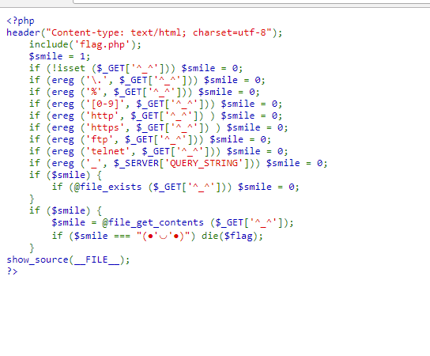

## 【题解】

**注：** 这里环境里的flag是自己输入的随机字符，所以不用考虑最后flag和答案不一致的问题

1.打开自己电脑中的浏览器，访问靶机开放的环境地址`http://IP:PORT/`来进行访问实验环境



2.我们可以直接看到php主要的逻辑代码：

```php
<?php  
header("Content-type: text/html; charset=utf-8");
    include('flag.php');
    $smile = 1;  
    if (!isset ($_GET['^_^'])) $smile = 0;  
    if (ereg ('\.', $_GET['^_^'])) $smile = 0;  
    if (ereg ('%', $_GET['^_^'])) $smile = 0;  
    if (ereg ('[0-9]', $_GET['^_^'])) $smile = 0;  
    if (ereg ('http', $_GET['^_^']) ) $smile = 0;  
    if (ereg ('https', $_GET['^_^']) ) $smile = 0;  
    if (ereg ('ftp', $_GET['^_^'])) $smile = 0;  
    if (ereg ('telnet', $_GET['^_^'])) $smile = 0;  
    if (ereg ('_', $_SERVER['QUERY_STRING'])) $smile = 0;  
    if ($smile) {
        if (@file_exists ($_GET['^_^'])) $smile = 0;  
    }  
    if ($smile) {
        $smile = @file_get_contents ($_GET['^_^']);  
        if ($smile === "(●'◡'●)") die($flag);  
    }  
show_source(__FILE__);
?>
```

3.服务器会包含一个flag.php文件，该文件直接访问无输出，但应该定义了`$flag`变量。

为了最终`die($flag)`的顺利执行，需要绕过上面的各种验证，而逻辑本身有两处矛盾：

1. `$_GET`数组本身提取自`QUERY_STRING`，`$_GET['^_^']`中key包含`_`符号，而`QUERY_STRING`却不允许。

2. `file_exists`需要寻找的文件必须不存在，但`file_get_contents`却能读到文件内容。
当然除了逻辑还有上面那一堆限制，比如参数的value但不可包含`. % 0-9`数字` http(s) ftp telnet`关键字，文件的内容为`unicode`的笑脸。

3.这里直接给出最终方案：

当`.`或`[]`之类的符号作为参数的key的时候，会被PHP改写为_，但由于QUERY_STRING为用户提交的内容，所以不修改。具体参见[http://ca.php.net/variables.external](http://ca.php.net/variables.external "http://ca.php.net/variables.external")。
`file_get_contents`可以获取远程数据，但常用网络协议已经被正则过滤，因此需要选取其他协议。查阅PHP支持的协议和包装，发现RFC 2397的data协议可用。巧合的是，`file_exists`对于data指向内容判断为不存在。
最终构造url为：

`http://IP:PORT/?^.^=data://text/plain;charset=unicode,(●'◡'●)`

4.获取flag：


